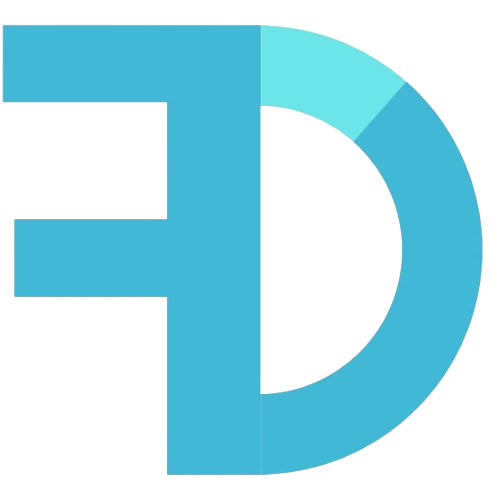

# WhatsOn-UP

  

## Project description
WhatsOn@UP system aims to be a central hub for all University of Pretoria events, providing a centralized platform for students and guests to easily find and manage events.

## Links
[Demo](https://youtu.be/Zxwq3aW9ctU?si=zDBVisABTy_0_pVk)

<table>
  <tr>
    <th>Video</th>
    <td><a href="https://drive.google.com/file/d/1NjTF3Wyfv0JfyUvZUSzZ3Qs84BKFjVUM/view?usp=sharing">Recorded demo video</a></td>
  </tr>
  <tr>
    <th>Project Board</th>
    <td><ul><li><a href="https://github.com/orgs/COS301-SE-2024/projects/85">Project Board</a></li></ul></td>
  </tr>
  <tr>
    <th>Documentation</th>
    <td>
     <ul>
       <li><a href="https://docs.google.com/document/d/1Ja-Ev1ghWPG8koCJdV99sALttg2e2dUh/edit">SRS Document (Google Docs)</a></li>
       <li><a href="./docs/SRS-document.md">SRS Document (GitHub)</a></li>
       <li><a href="https://docs.google.com/document/d/1SfIxE-KDSOgc1vl41UrfoCZFlWVLJbdIIYWA4zPoOc0/edit?usp=sharing">Testing Document</a></li>
       <li><a href="./docs/Contracts/Contracts.md">Contracts</a></li>
       <li><a href="https://www.figma.com/design/OjxWQqAXxuycjBsvbRyU0f/WhatsOn%40UP?node-id=0-1&t=rWZnW452JgRBb5ha-0">Wireframes</a></li>
     </ul>
    </td>
  </tr>
</table>

## Project status
## Tech Stack

## Team Members and Roles
 Name | Roles | Description |
|:------:|:------:|---------------|
|    **Khwezi Ntsaluba** (u22515012)   |Project Manager|I love a challenge and coding always brings one, Love working with my team. Having a work-hard and play-hard balance is important to me.|
|    **Zethembe Danise** (u20704209)  |Project Manager and Business Analyst|I am a determined person who pays meticulous attention to detail and am a social person who enjoys working in a collaborative environment.|
|    **Future Phahlamohlaka** (u22524798)  |Data Engineer & Business Analyst|Having an interest in research within the field of computer science, I do my best to ensure a solid, foundational understanding of content covered in (and outside of) the scope of my degree|
|    **Brenden van der Mescht** (u18332422)  |Business Analyst, UI Engineer and Designer|I am someone who loves everything related to computers. I am especially passionate about frontend development and enjoy the creative process of optimising both the appearance and functionality of apps. |
|    **Nokukhanya Ndlovu** (u22768352)  |Business Analyst, UI Engineer|I am driven by an insatiable curiosity and a firm belief in lifelong learning and adaptability. I embrace challenges as opportunities for growth.|
