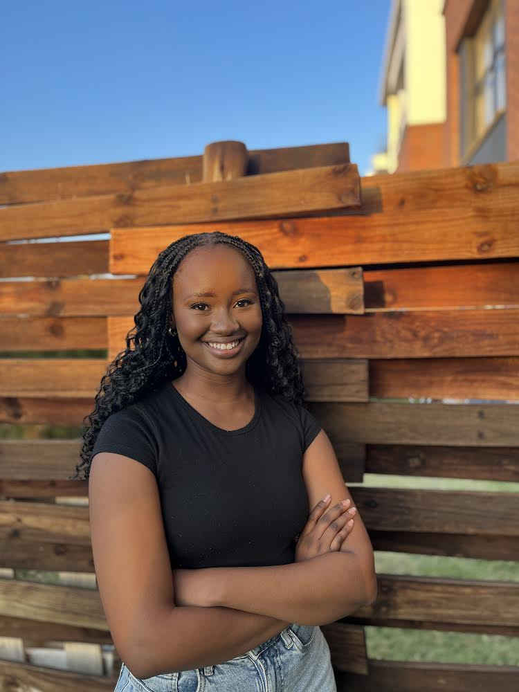
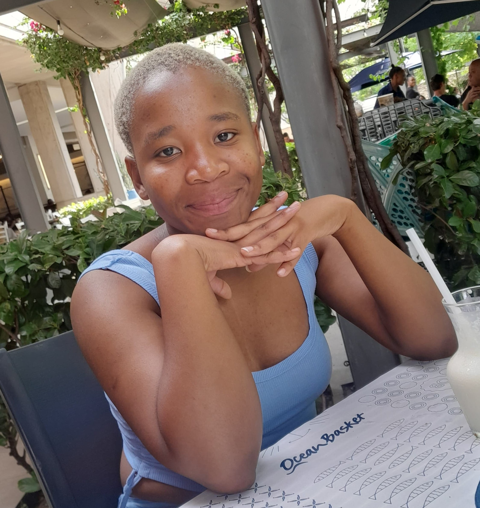
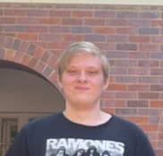
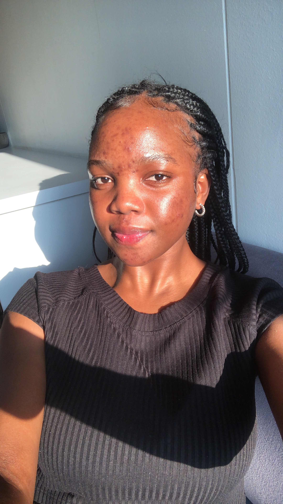

  

<h1 align="center"> WhatsOn@UP </h1>

## Project description
WhatsOn@UP system aims to be a central hub for all University of Pretoria events, providing a centralized platform for students and guests to easily find and manage events.

<table align="center">
  <tr>
    <th>Demo Videos</th>
    <td><ul><li><a href="https://drive.google.com/file/d/1NjTF3Wyfv0JfyUvZUSzZ3Qs84BKFjVUM/view?usp=sharing">Demo 1 Video</a></li></ul>
 
    <ul><li><a href="https://drive.google.com/file/d/1tH-Z4wL-U17SL5ecBKT7rOWEyJ3HX0MR/view?usp=drive_link">Demo 2 Video</a></li></ul></td>
  </tr>
  <tr>
    <th>Project Board</th>
    <td><ul><li><a href="https://github.com/orgs/COS301-SE-2024/projects/85">Project Board</a></li></ul></td>
  </tr>
  <tr>
    <th>Documentation</th>
    <td>
     <ul>
       <li><a href="https://docs.google.com/document/d/1Ja-Ev1ghWPG8koCJdV99sALttg2e2dUh/edit">SRS Document (Google Docs)</a></li>
       <li><a href="https://docs.google.com/document/d/1hoqGcpMkbaW6cMlomIt7ngt-VoZO51XU/edit?usp=drive_link&ouid=106979401378245433760&rtpof=true&sd=true">SRS Document (GitHub)</a></li>
       <li><a href="https://docs.google.com/document/d/1SfIxE-KDSOgc1vl41UrfoCZFlWVLJbdIIYWA4zPoOc0/edit?usp=sharing">Testing Document</a></li>
       <li><a href="./docs/Contracts/Contracts.md">Contracts</a></li>
       <li><a href="https://www.figma.com/design/OjxWQqAXxuycjBsvbRyU0f/WhatsOn%40UP?node-id=0-1&t=rWZnW452JgRBb5ha-0">Wireframes</a></li>
       <li><a href="https://docs.google.com/document/d/1_oVeZqWZemT3urwrFUN708oN37bDlg5WAx-VP4TaVw4/edit?usp=drive_link">Coding Standards</a></li>

</ul>
    </td>
  </tr>
</table>

## Tech Stack

  <h3 >Frontend</h3>

  

  <h3 >Backend</h3>

  

## Team Members and Roles
 Name |                           Roles                           | Description |
|:------:|:---------------------------------------------------------:|---------------|
|    **Khwezi Ntsaluba** (u22515012)   |        Project Manager, DevOps & Business Analyst         |Having an interest in research within the field of Computer Science, I always do my best to ensure that I obtain a solid, foundational understanding of the content covered in (and out of) the scope of my degree. I am always trying to challenge myself and find new ways to solve problems – this objective cemented by collaboration and always learning from others. There is always something that one can learn from another and that if one believes they are the smartest in a room, they are in the wrong room.|
|    **Zethembe Danise** (u20704209)  |         UI Engineer, Designer & Business Analyst          |I am a final-year student at the University of Pretoria, majoring in Information and Knowledge Systems with a dual focus on Computer Science and Genetics. My ultimate goal is to develop innovative algorithms and tools that not only contribute significantly to the fields of genetics and computer science but also bring tangible value to humanity. In my leisure time, I find joy in outdoor activities, and I've recently discovered a new love for participating in marathons. If you want me to say yes to a movie night, make sure Bruce Willis is the main character!|
|    **Future Phahlamohlaka** (u22524798)  |         Data Engineer, DevOps & Business Analyst          |I am a final-year Computer Science student deeply fascinated by cybersecurity. My academic journey has fueled my passion for protecting digital environments, and I am eager to apply my knowledge and skills to real-world challenges. With a keen interest in cyber threats, data protection, and ethical hacking, I am dedicated to advancing my expertise in this dynamic and ever-evolving field. My character is built on creativity, resilience, and ambition, driving me to continuously innovate and overcome obstacles in the pursuit of excellence.|
|    **Brenden van der Mescht** (u18332422)  |         UI Engineer , Designer & Business Analyst         |I am someone who loves everything related to computers. I am especially passionate about frontend development and enjoy the creative process of optimising both the appearance and functionality of apps. |
|    **Nokukhanya Ndlovu** (u22768352)  | Service Engineer, Integration Engineer & Business Analyst |My interest in Information Technology particularly started in Grade 9 when I was determined (perhaps a bit too much) to take IT as a subject so that I could hack into my then-boyfriend's WhatsApp. You can imagine my disappointment when I was handed a desktop and told to greet the world, but that's where it all began. Since then, I have immersed myself in various programming languages, striving to use my creativity and problem-solving skills to tackle any task I've been given. From delving into the intricacies of Java and SQL to exploring the nuances of mobile and web development, I have embraced every opportunity to expand my technical repertoire. My passion for software development, databases and cybersecurity runs deep and whether in individual tasks or group work, I always strive to foster a hard-working, supportive and inclusive environment where everyone's ideas are valued. I believe we can make the world a better place, one semicolon at a time.|
