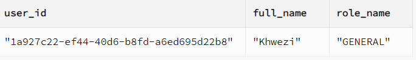
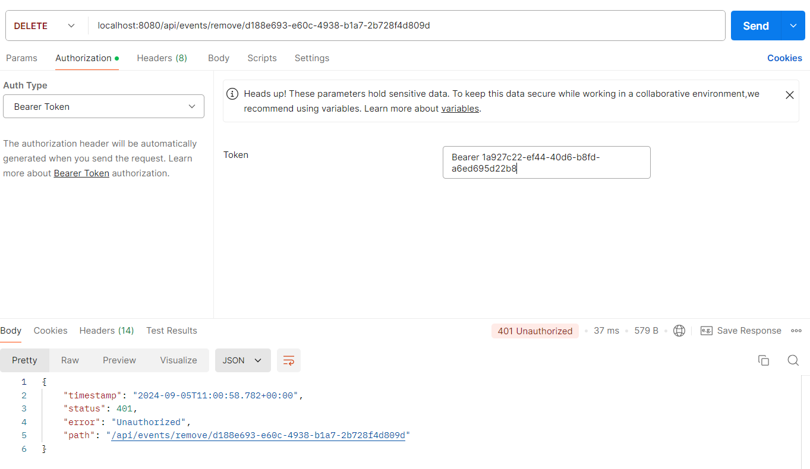

1. ## Usability

1.1  The application should have an intuitive user interface, easy navigation, and clear event categorization to ensure users can quickly find and engage with events of interest.  

Strategy:
* Designing a simple Intuitive layout that allows for easy navigation between pages.

  Implementation:

* We used Interface metaphors which have the ability to make learning the system much easier,this helps the users to understand underlying conceptual models.

Examples:
(These examples are not comprehensive; they merely demonstrate the concepts utilised in the project.)
| Material interface metaphors | Conceptual understanding |
| :---- | :---- |
| **Home Icon** (very common in websites or apps for navigation to the introductory page) | Users understand that pressing "home" will take them back to a familiar or central point in the app or website |
| **Icon of Multiple People** (used to represent groups, teams) | Users understand that clicking on this icon will take them to a section where they can connect with people, view attendees, or manage groups.(You would see this in broadcast and event Manage events where the Admin or Host is able to manage administration tasks that can affect a group of people)  |
| **Tiles Describing Event Categories** (used in event management platforms and filter tiles):  |  Users understand that each tile represents a distinct event category (e.g., music, sports, workshops), much like how they’d see categories or schedules in a physical event venue.  |
| **Loading circles** | Users understand that they need to wait while the process completes, just as they would wait for a task to finish in real life.This allows the user to stay informed of changes in the app. |

2. ## Performance

2.1 The application should respond quickly to user interactions, with fast loading times for event listings, calendar views, and navigation features.  

Strategy:

* Making use of state management tools
* The use of performance testing tools

Implementation:

* Currently we are using the following tools to test performance
    * Google lighthouse
    * Flutter integration testing would give us an indication of performance progression.
* Current state management tools being used
    * Flutter providers-helps in managing state and sharing data across an application .How this helps with performance is that it allows data to be passed down the widget tree and notifying dependent widget when data changes creating a fast seamless experience for the user in terms of latency .The concept of providers is similar to the Observer pattern.                                                                                    

* Cloud run provides built-in load balancing and global distribution mechanisms that reduce latency and improve performance during high traffic.The use of Joins rather than hibernate functions because joins are handled directly by the database, which is optimised for query execution. Whilst hibernate functions are handled in the services layer (this is meant to separate the database logic from the application). Another reason why joins provide better performance is because the database retrieves the data from multiple tables in a single query. This reduces the number of round trips between your application and the database. Whilst hibernate uses object-relational mapping (ORM), which often involves multiple SQL queries to fetch data from related tables. This often results in the N+1 problem, where multiple queries are executed to load related entities, resulting in slower performance.

Automatic Scaling: Cloud Run automatically scales up and down based on the incoming traffic. (scalability) This means that it can handle sudden traffic spikes by dynamically adjusting the number of container instances, and it can also scale down to zero when there’s no traffic, optimising resource usage.

3. ## Security

3.1  User data should be securely stored and transmitted, with measures in place to prevent unauthorised access, data breaches, and malicious activities.  

Strategy :
* Make use of token-based authorisation and use use-role based security in the services
* Making use of Role-based access control

Implementation:

* We implemented JWT for user authentication across the services. Each service verifies the validity of the JWT, and if it is valid, the service proceeds with the request.

### Role-based access control

Currently, the system employs **four user roles**: **guest**, **general**, **host**, and **admin**, each providing distinct application views and varying levels of privileges.

* **Guest**: Has the most limited access, primarily able to view public content.
* **General**: Has access to additional features beyond a guest, such as interacting with content, but still with limited control.
* **Host**: Can manage events, create content,broadcast any information that needs to be communicated to their attendees (this is limited only to the events they have created not other hosts/users events).
* **Admin**: Has full control over the system, including managing users, content, and application settings..

### Access control matrix to illustrate different privileges

| Functionality | Guest users  | General users  | Host users | Admin users |
| :---- | :---- | :---- | :---- | :---- |
| Create event | no | no | yes | yes |
| Update event | no | no | yes | yes |
| Delete event | no | no | yes | yes |
| Read Event | yes | yes | yes | yes |
| Update Profile | no | yes | yes | yes |
| Broadcast on events | no | no | yes(only events they specifically host) | Yes (all events even the ones they don’t host) |
| Broadcast to all users | no | no | no | yes |
| View Recommended Events | no | yes | yes | yes |
| View Analytics | no | no | yes | yes |
| Save Events | no | yes | yes | yes |
| Manage Attendees  | no | no | yes(only on events they specifically host) | yes |
| RSVP event | no | yes | yes | yes |
| View all private events | no | (only if they are invited to the private event) | (only if they are invited to the private event /they created the event) | yes |
| View public events | yes | yes | yes | yes |
| Application for Host privileges  | no | yes | no | no |

### Role based security in the services(Backend)

Example :   
We have ensured that users have access to the endpoints available to their role.  
Here is an example of a general user attempting to delete an event (The UI wouldn’t give the user the option to create an event,this is just to demonstrate using postman what would happen if you do not qualify to use a endpoint based on your role)  

4. ## Accessibility

4.1 The application should be accessible to users with disabilities.

Strategy:

*The application must be screen reader friendly.
* Addition of dark mode and light mode

Implementation:

We integrated the device's screen reader features to ensure compatibility with our app.

\[insert\]

5. ## Scalability

5.1 The application infrastructure should be able to handle increasing numbers of users and events without degradation in performance or reliability.  

Strategy:

* Using auto scaling groups in cloud environments.
*  Incoming traffic should be distributed evenly across server instances.

Implementation:

Scaling Groups

* We are currently using google cloud for our services.How it does this is as the load increases or the services increase each service can scale horizontally to ensure that no one service is overloaded with requests.
* The use of Joins rather than hibernate functions because joins are handled directly by the database, which is optimised for query execution. Whilst hibernate functions are handled in the services layer (this is meant to separate the database logic from the application). Another reason why joins provide better performance is because the database retrieves the data from multiple tables in a single query. This reduces the number of round trips between your application and the database. Whilst hibernate uses object-relational mapping (ORM), which often involves multiple SQL queries to fetch data from related tables. This often results in the N+1 problem, where multiple queries are executed to load related entities, resulting in slower performance.
* Cloud run provides built-in load balancing and global distribution mechanisms that reduce latency and improve performance during high traffic. FIX

  \[dash board\]

  
