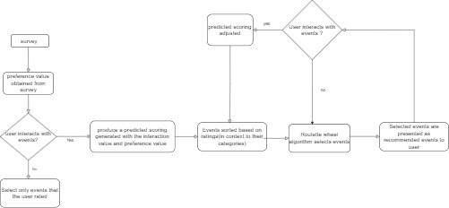
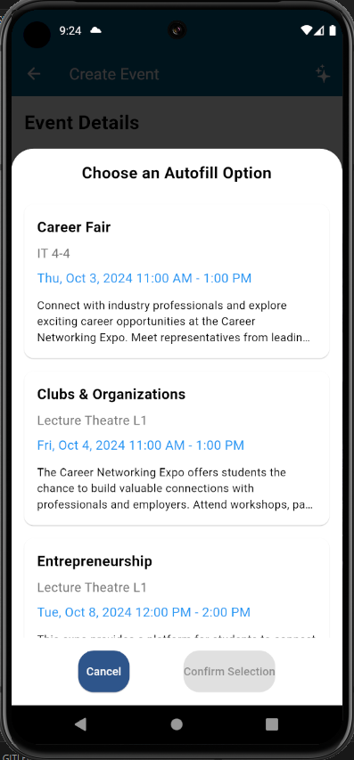
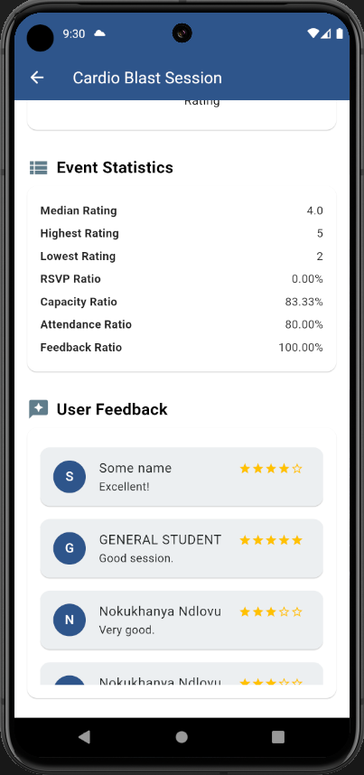
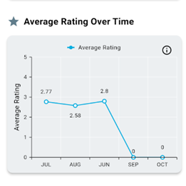
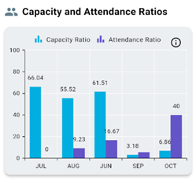
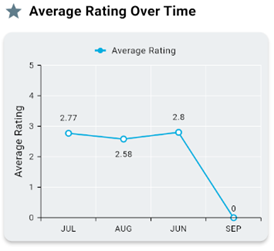
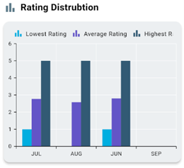
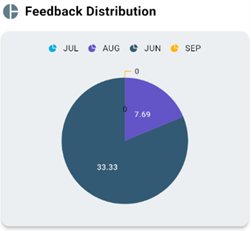

# WOW FACTORS

## Recommendation System

Recommendation algorithm used: 
**Content-based filtering**

**Description:**   
The method is supposed to use attributes of an item and through the interaction the user has with the item the algorithm would decide what content to recommend to the user.

**Implementation:**  
The attributes that we are looking at would be the categories of the event.The user would initially give us their preferences through a survey as they sign up on the app.As the user Saves or even RSVP’s an event it would give us a more refined understanding overtime what events the user has an affinity for.  

### Algorithm

1. **Preference scoring**  
   1. Initial rating is obtained in the survey in which the user chooses a category they would be interested in .The categories chosen will be rated by the user.  
   2. We also have an interaction value in which will give us a more confidence on what events really interests users we get these values through rsvping and saving of events by the user  
   3. If no interaction has been recorder the categories that have been rated initially would be picked  
   4. If we have the preference value and interaction value we can produce the final rating/predicted ratings rating=(interaction preference+survey preference)×binary digit  
2. **Sorting Events**  
   1. All events are then sorted in a descending order all events with higher predicted ratings(based on category they fall in) would appear first  
3. **Roulette Wheel selection algorithm**  
   1. The fitness will then be determined of each category using the predicted preference scoring of the categories producing a total fitness.(addition of all ratings)  
   2. A random number is generated between 0 to total fitness then the algorithm will iterate over the sorted events adding up their ratings until the sum exceeds the random value.where this occurs that event gets selected  
   3. Special case would be if all the event fitness have a rating of 0 the algorithm will then select random events without using rations  
   4. After selection the event is removed from a list and the process is is repeated until an number of events are selected

      

### How is this algorithm progressing overtime to create a better user experience?  
Through continuous interaction with events in the app the proportion in the context of the total fitness for a certain category will increase the more the user interacts with the category, also affecting the fitness to be weaker for other categories that are not being interacted with. 

# 
#
## Analytics System
# **Analytics Overview**

#### Admin Access

* Admin users have access to analytics for all events within the platform.  
* They can also view analytics for specific hosts' events, providing insights into overall performance and user engagement.

#### Host Access

* Hosts can view analytics specifically for their own events, allowing them to track performance metrics and attendee feedback.

#### **Insights and Recommendations**

* The analytics feature can assist hosts in selecting the optimal venue, time, and date for future events by leveraging insights from past event data and performance trends. This guidance is provided through the Smart Suggestion feature during event creation.  
* Analytics can help the host view user feedback on their events and give a summary of overall feedback of events.
#

#

#
#### **Key Analytics Metrics**

**Admin View for all events:**
1. Average Rating over time  
 Shows the average rating of all events for each month over time.  
 Could be used for:

    *  Track overall event quality trends.

    *  See periods of improvement or decline in event satisfaction.

 

 

2. Capacity and Attendance rations  
 Shows 2 ratios for each month: Capacity ratio which shows how much of the venue was filled and the Attendance ratio which shows how many people who rsvpd to the event actually showed up.  
 Could be used for:

    *  See the efficiency of venue utilisation.

    *  Identify overbooking/underbooking issues.

    *  Optimise locations for future events.

3. Feedback ratio over time  
 Shows the percentage of people who provided feedback after each event  
 Could be used for:

    *  See user engagement for the app and events.

 

4. RSVP ratio over time  
 Shows the proportion of rsvps relative to the total number of potential attendees  
 Could be used for:

    *  See how compelling events are to potential attendees.

    *  See how effective event invitations are.

    *  See which events were more popular among users.

 

 

5. Total event duration per month  
 Shows the total number of hours of event durations of all events that occurred each month  
 Could be used for:

    *  Track overall volume of events on the app

    *  See seasonal trends in scheduling.

    *  See app growth and usage over time.

 

 

6. Rating distribution  
 Shows the highest, median, and lowest ratings for all events each month  
 Could be used for:

    *  Identify outliers.

    *  Understand the range and distribution of event quality.

 

 

7.  Skewness over time  
 Indicates whether ratings tend to be concentrated on the more positive or negative side for each month for all events  
 Could be used for:

    *  See the distribution of ratings besides just the average.

    *  See if there’s a consistent bias towards higher or lower ratings.

    *  Detect changes in rating patterns.

 

 
**Admin view for specific host:**

 1. Average rating over time  
 Shows the average rating of all events hosted by that user for each month  
 Could be used for:

    * Track host’s performance trends

    * Identify hosts that consistently get high or low ratings

    * Compare the host’s performance against the over platform

 

 

2.  Rating distribution  
 Shows the highest, median and lowest ratings for all events by the specific host each month  
 Could be used for:

    * Understand the range and consistency of a host’s event quality

    * Identify if the host has consistent bad events or good events

    * See patterns in host’s performance (improvement over time, etc.)

 

 

3. Feedback distribution  
 Shows the percentage of attendees who provided feedback after the event ended  
 Could be used for:

    * See if the host has the ability to encourage feedback

    * See overall engagement levels for the host

 

### **Benefits of Analytics**

#### For Admin:

* **Comprehensive Oversight**: Admins can monitor the overall performance of events, ensuring quality and engagement across the platform.  
* **Data-Driven Decision Making**: Access to detailed analytics enables admins to identify trends, assess user behaviour, and make informed decisions regarding platform improvements.

#### For Host:

* **Enhanced Event Planning**: Hosts can utilise performance insights to optimise future events, enhancing attendee experience and satisfaction.  
* **Targeted Improvements**: By understanding attendee preferences and feedback, hosts can make data-driven adjustments to their event strategies, leading to increased attendance and positive ratings.

**Implementation**

## APPROACH 1 “EXTERNAL  ANALYTICS SYSTEM”:  

**Description:**   
This approach leverages Google Analytics for data collection, Firebase dashboard for visualisation, and integrates with other tools for enhanced data management and analysis.

**Implementation:**

#### **Types of Data to be Collected**
##
**1\. User Engagement Metrics:**

    1.1 Active Users**: Measures the number of unique users engaging with the app daily/weekly. 

**Implementation:**

  Automatically tracked by Firebase analytics through user identifiers.

    1.2 Session Duration**: Tracks the average time users spend on the app per session. 
#

**Implementation:**

 Automatically tracked by Firebase analytics. 

##
**2\. Event Interactions:**
# 
    2.1 Clicks, Views, and RSVPs**: Logs the number of interactions users have with events, such as clicking on event details, viewing event pages, or responding to invitations.

 **Implementation:**

 Custom events logged using Firebase analytics. Example events might include `new_vs_returning_users`,`user_retention`, and `detailed_event_clicks`.
 #

    2.2 Cancellations**: Records the number of times users cancel their event RSVPs. 

**Implementation:**

Custom event for cancellations, e.g.,`event_cancellations`
##

**3\. Event Popularity Metrics:**

**All of these below would be tracked as custom events in google analytics**

* **Event Views**: Measures the number of views or clicks on event details, providing insights into event interest.

#### **Scalability Considerations**

* For the WhatsOn@UP analytics system, we will initially leverage the Supabase database, Firebase Analytics (free tier), and BigQuery (free tier) to handle our data collection and visualisation needs. This approach is cost-effective and well-suited for our immediate requirements. However, as our data volume grows and analytics needs become more complex, scaling will be necessary. To accommodate future growth, we could implement ETL (Extract, Transform, Load) processes to migrate data from Firebase Analytics into a more scalable data warehouse or data lake, such as Google BigQuery or AWS Redshift. This will facilitate handling larger datasets and performing more sophisticated queries. Additionally, if real-time data analysis becomes crucial, we may incorporate stream processing tools like Google Cloud Dataflow to manage and analyse data in real time.

*  However, it is crucial to keep in mind that just like most tools, Firebase Analytics has limitations. In this scenario, there are limitations on the number of hits per month or complexity in custom reporting.Nonetheless, if we manage to keep the hits down then we should be able to cater to the 50 000 users requirement for out project See below:

#### **Visualization and Rendering of Analytics**

**Visualisation Tools:**
##
1. **Google Data Studio**:  
   * **Features**: Free and integrates with Google Analytics. Allows for the creation of interactive dashboards and detailed reports.  
   * **Visualisations**: Includes line charts for active users, histograms for session duration, bar charts for event interactions, and pie charts for event popularity metrics.  
   ##
2. **FL Chart (Flutter Package)**:  
   * **Features**: Provides customizable charts directly within the Flutter app for real-time data visualisation.  
   * **Usage**: Suitable for embedding interactive charts into the app’s analytics dashboard.  
   ##
3. **Syncfusion Flutter Charts (Flutter Package)**:  
   * **Features**: Offers advanced charting capabilities for more complex visualisations within the app.  
   * **Usage**: Ideal for detailed data visualisations and complex reporting needs
   ##

Approach 1 External implementation DFD  

## APPROACH 2 “IN-HOUSE ANALYTICS SYSTEM”:

#### **1\. Data Collection**

**Backend Services (Spring Boot/Kotlin)**:

* **Event Tracking**: Implement event tracking in backend services. Each time an event of interest occurs (e.g., user interaction, event RSVP, cancellation), log this event to your database.  
* **API Endpoints**: Create API endpoints to capture analytics data. For instance, endpoints to record user interactions, event RSVPs, or session durations.

  Table showing the endpoints associated with approach 1 and 2 implementation

| Functionality | Endpoint name | Endpoint url | Host | Admin |
| :---- | :---- | :---- | :---- | :---- |
|  | get past events  | *({{host}}:8084/analytics/host/get\_past\_events)*  | x |  |
|  | get aggregate data  | *({{host}}:8084/analytics/host/get\_aggregate\_data)* | x |  |
|  | get  | *({{host}}:8084/analytics/host/get)*  | x |  |
|  | get past events by host  | ({{host}}:8084/analytics/admin/get\_past\_events\_by\_host/69ae72bc-8e2b-4400-b608-29f048d4f8c7) |  | x |
|  | get aggregate data by host  | *({{host}}:8084/analytics/admin/get\_aggregate\_data\_by\_host/69ae72bc-8e2b-4400-b608-29f048d4f8c7)* |  | x |
|  | get by host | *({{host}}:8084/analytics/admin/get\_by\_host/69ae72bc-8e2b-4400-b608-29f048d4f8c7)*  |  | x |
|  | get all past info for all hosts | *({{host}}:8084/analytics/admin/get\_for\_all\_hosts)* |  | x |
|  | get for all events | *({{host}}:8084/analytics/admin/get\_all\_events)* |  | x |
|  | get aggregate for all events  | *get aggregate for all events*  |  | x |

**Frontend (Flutter)**:

* **Instrumentation**: Add code in Flutter app to capture user interactions and send this data to the backend through the MVVM. This could include tracking button clicks, screen views, session durations, etc.  
* **Data Submission**: Use HTTP requests to send captured data from the frontend to backend API endpoints.

#### **2\. Data Storage**

**Supabase DB**:

* **Database Design**: Design database schemas in Supabase to store various types of analytics data. For example, tables for user interactions, event data, and session logs.  
* **Data Ingestion**: Ensure that your backend services insert data into the Supabase database correctly, capturing all necessary metrics.

#### **3\. Data Processing**

**Backend Services**:

* **Data Aggregation**: Implement logic to aggregate and process the raw data stored in Supabase. This could involve calculating metrics such as active users, average session duration, and event popularity.

#### **4\. Data Visualization and Reporting**

**Custom Dashboard**:

* **Frontend Integration**: Build a custom dashboard within our existing application to visualise the processed data. We can use Flutter for web development or other frameworks compatible with our tech stack.  
* **Visualisation Tools**: Utilise libraries like `syncfusion_flutter_charts` in Flutter to create charts and graphs for your dashboard

#### **5\. Scalability Considerations**

**Database Scaling**:

* **Indexes**: Use indexes in Supabase to optimise query performance for large datasets.  
* **Partitioning**: Implement database partitioning if necessary to handle large volumes of data efficiently.

**Backend Scaling**:

* **Horizontal Scaling**: Ensure that your Spring Boot/Kotlin services are capable of horizontal scaling to handle increased load.  
* **Caching**: Implement caching strategies to reduce database load and improve performance.

  

  
 

 

 
